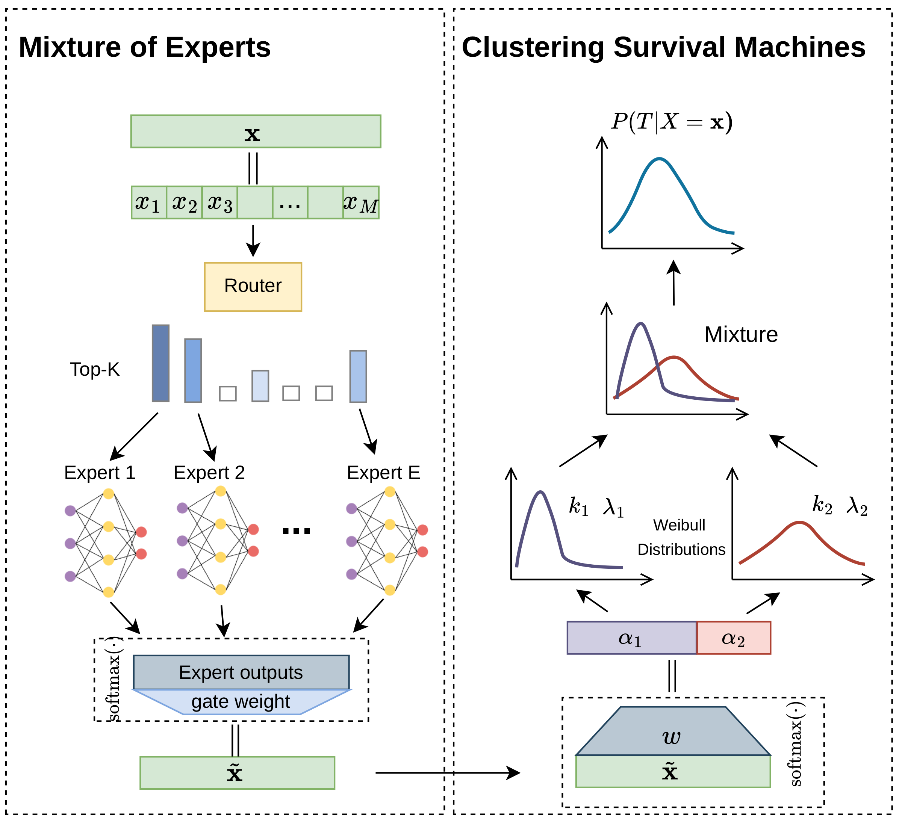

# AdaCSM

AdaCSM is a Mixture-of-Experts (MoE) survival modeling framework that combines representation learning, adaptive expert routing, and time-to-event prediction for heterogeneous clinical populations.

This repository provides the official AdaCSM codebase and reproducibility scripts for the ACM publication.

## Paper

- ACM publication: [https://dl.acm.org/doi/full/10.1145/3807503.3819574](https://dl.acm.org/doi/full/10.1145/3807503.3819574)

## Motivation

Clinical survival cohorts are often heterogeneous: different subgroups follow different progression patterns and risk dynamics. A single global survival function can miss this structure.

AdaCSM addresses this by learning:

- A shared feature representation for survival prediction
- Multiple expert survival components that capture subgroup-specific behavior
- An adaptive MoE routing mechanism that selects relevant experts per patient

This design improves both predictive flexibility and interpretability of subgroup behavior.

## Method At A Glance

AdaCSM models survival outcomes with an MoE architecture:

- **Encoder/Backbone** transforms patient covariates into latent representations
- **Expert survival heads** model distinct survival patterns
- **Gating network** produces instance-specific expert weights (or top-k routing)
- **Aggregated survival prediction** combines expert outputs into final risk/survival estimates

In practice, this lets AdaCSM capture non-uniform risk structure across populations while preserving a transparent expert-assignment view for analysis.
These expert-assignment patterns can also be used for subtype-style clustering and patient stratification.

## AdaCSM Architecture



## Why Use This Repo

- End-to-end training and evaluation for AdaCSM
- Dedicated reproducibility scripts for cohort-level experiments
- Built-in baseline lane and AdaCSM lane for clean comparisons
- Interpretability tooling (gating visualization and feature-attribution scripts)

## Repository Scope

- Training and evaluation code: `main.py`, `main_adacsm.py`, `models/`, `utils/`
- Hyperparameter search: `tune_adacsm_optuna.py`
- Reproducibility scripts: `scripts/`, `plot_km.py`, `plot_pareto_frontier.py`, `visualize_moe_gates.py`
- Baseline lane scripts: `baselines/run_baseline_models.sh`, `baselines/run_baseline_optuna.sh`
- AdaCSM lane scripts: `src/run_adacsm_model.sh`, `src/run_adacsm_dense_experiments.sh`, `src/run_adacsm_topk_experiments.sh`, `src/run_adacsm_optuna.sh`

## Project Layout

- `src/`: AdaCSM-first run entrypoints and wrappers
- `baselines/`: baseline model run scripts and python runner
- `models/adacsm_api.py`, `models/adacsm_torch.py`: AdaCSM-named model modules

## Data Availability

- Included open datasets:
  - `datasets/support2.csv`
  - `datasets/flchain.csv`
  - `datasets/pbc2.csv`
  - `datasets/framingham.csv`
- Not included:
  - Restricted patient-level data and non-public derivatives

See `DATA_ACCESS.md` for release-policy details.

## Environment Setup

```bash
conda create -n dcsm python=3.10 -y
conda activate dcsm
pip install -r requirements.txt
```

## Quick Start

Single AdaCSM run:

```bash
bash src/run_adacsm_model.sh --dataset FRAMINGHAM --num_experts 32 --top_k 2
```

Supported datasets in this release include `support`, `flchain`, `PBC`, and `FRAMINGHAM`.

## Reproducibility Workflows

Baseline lane:

```bash
bash baselines/run_baseline_models.sh
bash baselines/run_baseline_optuna.sh
```

AdaCSM lane:

```bash
bash src/run_adacsm_dense_experiments.sh
bash src/run_adacsm_topk_experiments.sh
bash src/run_adacsm_optuna.sh
```

## Citation

```text
Please cite the ACM paper listed above when using this repository.
```
